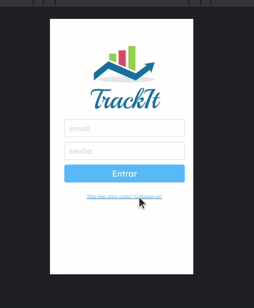

# Track It

An easy way to track your habits. Create your account and sign in to add and follow your daily habits.



Try it out now at https://trackit-one-beta.vercel.app/

## About

This is an web application with which lots of people can track their habits. Below are the implemented features:

- Sign Up
- Login
- Add habit
- Delete Habit
- List all habits
- List habits of the current day
- Check/Uncheck habit
- Progress bar

By using this app users can follow their progress every day and help them create and maintain habits in their routine.

## Technologies

The following tools and frameworks were used in the construction of the project:<br>


## How to run

1. Clone this repository
2. Install dependencies
```bash
npm i
```
3. Run the front-end with
```bash
npm start
```
4. You can optionally build the project running
```bash
npm run build
```
5. Finally access http://localhost:3000 on your favorite browser. 

